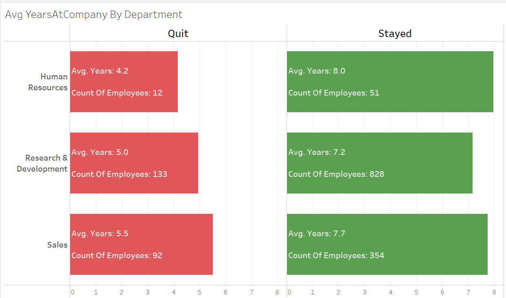
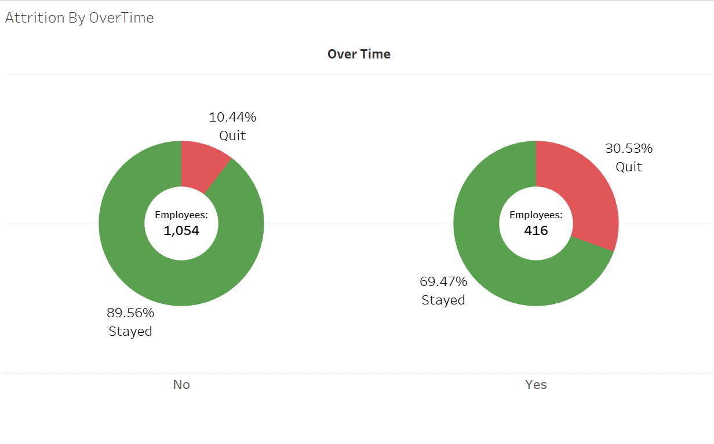

# Strategic Insights: Exploring Employee Attrition Patterns through HR Analytics

This data analytics project delves into the realm of Human Resources using a comprehensive [dataset designed by IBM data scientists](https://www.kaggle.com/datasets/pavansubhasht/ibm-hr-analytics-attrition-dataset/data). The primary focus is on understanding employee attrition, a complex challenge faced by organizations. Leveraging the power of Tableau, Excel, and Python, the project applies data visualization and machine learning techniques to find out the factors influencing attrition.

The project aims to answer crucial questions like 'What is the breakdown of distance from home by job role and attrition?' and 'How does average monthly income vary by education and attrition?' By utilizing HR analytics, the analysis not only identifies trends but also empowers HR personnel to proactively address potential attrition cases.

# Table of Contents
- [Strategic Insights: Exploring Employee Attrition Patterns through HR Analytics](#strategic-insights-exploring-employee-attrition-patterns-through-hr-analytics)
- [Table of Contents](#table-of-contents)
  - [Key Findings](#key-findings)
  - [Data Analysis](#data-analysis)
    - [A quick overview with Microsoft Excel](#a-quick-overview-with-microsoft-excel)
      - [Familiarization with the data](#familiarization-with-the-data)
      - [Check for nulls and duplicates](#check-for-nulls-and-duplicates)
      - [Check unique values in categorical columns](#check-unique-values-in-categorical-columns)
      - [Removal of unnecessary columns](#removal-of-unnecessary-columns)
    - [Python for numerical overview](#python-for-numerical-overview)
    - [Dive into the data with Tableau](#dive-into-the-data-with-tableau)
      - [Data Exploration](#data-exploration)
  - [Post-analysis Recommendations](#post-analysis-recommendations)

## Key Findings

* Single employees are more likely to quit in comparison with Married or Divorced 
* Younger employees are at a higher risk of experiencing attrition as in comparison with older coworkers 
* Ageism and gender bias don't seem to have an impact in decisions to quit
* Employee attrition is not much influenced by duration. An employee's decision to leave the company is not significantly influenced by how long they have worked there.
* Job Involvement and Performance Rating don't impact salary increases
* Sales department experiences the highest attrition rate with Sales Representative having the highest attrition rate among other positions
* Employees working overtime are more likely to leave, indicating a need to keep a balance between workload and personal time
* Distance from home doesn't seem to have much of an impact on the decision to quit. A difference from close-range to long-range of 3-5% in average. Most of the employees prefer to be located in the close-range. 
  
## Data Analysis
### A quick overview with Microsoft Excel
- Familiarization with the data
- Check for nulls and duplicates
- Removal of unnecessary columns

#### Familiarization with the data

There are 35 variables and 1,470 employee records.

* Age: Age in years of the employee
* Attrition: People who people leave
* BusinessTravel: How often an employee embark on a job related travel
* DailyRate: Daily rate at which an employee is paid
* Department: Department where the employee works
* DistanceFromHome: Distance an employee travels from home to work
* Education: Level of education of the employee (1. 'Below College'; 2. 'College'; 3. 'Bachelor'; 4. 'Master'; 5. 'Doctor')
* EducationField: What field the employee studied in school
* EmployeeCount: Count of employee
* EmployeeNumber: EMployee number
* EnvironmentSatisfaction: Employee environment satisfaction (1. 'Low'; 2. 'Medium'; 3. 'High'; 4. 'Very High')
* Gender: Gender of the employee
* HourlyRate: Hourly rate of pay of the employee
* JobInvolvement: Employee job involvement ratings (1. 'Low'; 2. 'Medium'; 3. 'High'; 4. 'Very High')
* JobLevel: Employee Job level (1. 'Entry'; 2. 'Junior'; 3. 'Mid'; 4. 'Senior'; 5. 'Executive')
* JobRole: Employee Job role
* JobSatisfaction: Employee Job Staisfaction (1. 'Low'; 2. 'Medium'; 3. 'High'; 4. 'Very High')
* MaritalStatus: Employee Marital Status
* MonthlyIncome: Employee monthly income
* MonthlyRate: Employee Monthly rate
* NumCompaniesWorked: Number of companies the person have worked in the past
* Over18: Age over 18 years or not
* OverTime: Work overtime
* PercentSalaryHike: Salary increment in Percentages
* PerformanceRating: Performance rating (1. 'Low'; 2. 'Good'; 3. 'Excellent'; 4. 'Outstanding')
* RelationshipSatisfaction: Relationship satisfaction (1. 'Low'; 2. 'Medium'; 3. 'High'; 4. 'Very High')
* StandardHours: Employee standard hours worked
* StockOptionLevel Stock options level
* TotalWorkingYears Total working hours
* TrainingTimesLastYear: Total working years
* WorkLifeBalance: Work life balance rating (1. 'Bad'; 2. 'Good'; 3. 'Better'; 4. 'Best')
* YearsAtCompany: Years at the company
* YearsInCurrentRole: Years in current role
* YearsSinceLastPromotion: Years since last promotion
* YearsWithCurrManager: Years with current manager

#### Check for nulls and duplicates
* Leveraging Conditional Formatting to highlight rows that contain either blank cells or errors in formulas

Our dataset does not have neither blank sells nor errors in formulas

* Excel provides a tool to clean all duplicates by selected columns `Data tab -> Remove duplicates` or a shortcut <kbd>Alt</kbd> + <kbd>A</kbd> + <kbd>M</kbd>
  

Our dataset does not have duplicates

#### Check unique values in categorical columns

This step is necessary in case there are values like **'Yes'** and **'Y'**

For that, we need to use `UNIQUE` and `FILTER` Excel functions. We copy all the needed column names to another sheet and apply the following formula to A2 cell: `=UNIQUE(FILTER(EmployeeAttrition, EmployeeAttrition[#Headers]=A$1))`, then we drag the formula to the last column.

#### Removal of unnecessary columns
* EmployeeCount - has only one value - **"1"**
* EmployeeNumber - basically it is employee ID, which does not provide any characteristics
* Over18 - has only one value - **"Y"**
* StandardHours - has only one value - **"80"**

### Python for numerical overview
The [eda.ipynb](./eda.ipynb) file describes in-depth feature exploration. 

I came to a conclusion that 'HourlyRate', 'DailyRate', 'MonthlyRate' columns are redundant for our analysis.

After detailed statistical Feature Importance analysis utlizing feature correlation, hypothesis testing using T-Test, ANOVA, Chi-squared, and PostHoc, I uncovered the following insights:

Attrition has a significant impact from these features:

* `BusinessTravel`
* `Department`
* `EducationField`
* `OverTime`
* `JobRole` and `JobLevel`
* `MaritalStatus`
* `DistanceFromHome`
* `TrainingTimesLastYear`
* `JobInvolvement`
* `JobSatisfaction`
* `WorkLifeBalance`
* `EnvironmentSatisfaction`
* `MonthlyIncome`
  
Time-related features are highly correlated between each other, which allowes us to "group" them and consider as higly dependant from each other: *Age*, *TotalWorkingYears*, *YearsInCurrentRole*, *YearsWithCurrManager*, *StockOptionLevel*, *YearsAtCompany*

Also if some features from above have an impact from other features as well:

`Department`: Differs in *MontlyIncome* and *WorkLifeBalance*; Sales and Research & Development departmentes have a significant difference. Departments also differ in *JobRole/JobLevel* and *EducationField*

`OverTime`: Impacts on *EnvironmentSatisfaction*

`JobRole` and `JobLevel`: Are influenced by *Age*, *MonthlyIncome*, *NumCompaniesWorked*, *TotalWorkingYears*, *YearsAtCompany*, *YearsInCurrentRole*, *YearsSinceLastPromotion*, *YearsWithCurrManager*

`MaritalStatus`: Has an impact by *Age*

### Dive into the data with Tableau

Tableau Public provides users with a free cloud platform to publish and share Tableau dashboards. Here you can find all charts and dashboards for this project: [Tableau Public HR Employee Attrition Dashboard](https://public.tableau.com/views/HREmployeeAttrition_17092245204090/Dashboard?:language=en-US&:sid=&:display_count=n&:origin=viz_share_link)

#### Data Exploration
Overall Attrition

> The Employee Attrition rate is **16.1%**. 

> The Sales department has the highest attrition rate

> Younger employees tend to quit the company more (red bars). The highest number of Active employees lies within the 34-44 age range. 

Education

Education Field

> The company has a diversity in education background. A majority of employees hold a Bchelor's degree. The Life Science and Medical are the most common fields of study among our employees.

Job Satisfaction By Department, Role, and Attrition

> The majority of all employees have High or Very High job satisfaction, among which around 16% have quit the company, whereas attrition rate of employees with Low and Medium job satisfaction is 24% 

Average Years At Company By Department

> Leading at Average Years At Compeny before Quiting the company the Sales department with 5.5 years. The highest number of average years among employees has the HR department. 

> 30% of Employees who work OverTime **Quit** 

**Dashboard**

## Post-analysis Recommendations

* Find ways to help improve work-life balance, especially for those who've worked at the company a while
* Invest in everyone's learning and professional development, make sure everyone has the latest tools and skills they need to succeed in their roles. This keeps everyone engaged and brings fresh ideas to the table
* Create a safe space for everyone to share their thoughts and ideas, whether it's about how to improve the work environment, solve problems, or just make things better overall
* Every department faces unique challenges. Work closely with each team to find ways to improve their working conditions, boost their engagement, and make sure they're not overloaded.
* Understand what matters most to each employee, especially newer employees, and create an environment that supports their growth and ambitions. This will help keep them motivated and engaged in the long run.